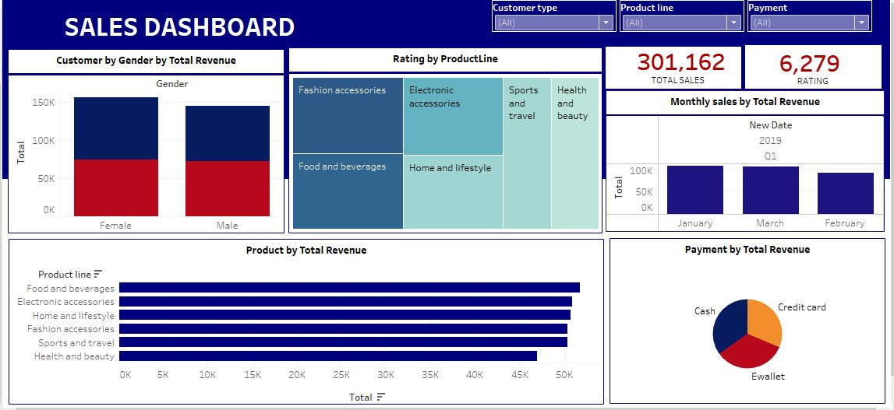
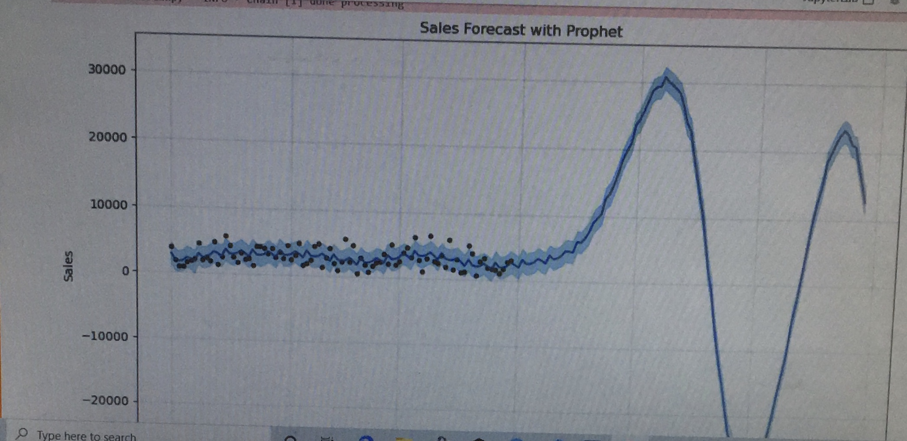

# Sales-Analysis-and-Forecasting

## Introduction

This project focuses on analyzing and forecasting sales data to uncover trends, customer behaviors, and product performance. The insights gained will support business decisions related to marketing, inventory management, customer service, and revenue optimization.

## Problem statement

1. What is the highest performing month?
2. What product line has the highest revenue and profit?
3. Which customer type and gender has the highest purchasing power?
4. Which location has the highest revenue generated?
5. What is the most preferred payment type?
6. Which product line has the highest and lowest rating?

## Data
The data contains various columns such as Invoice ID, Branch, City, Customer_type, Gender, Product_line, Unit_price, Quantity, Tax_5%, Total, cogs, gross_margin_percentage, gross_income, Date, Time, Payment, and Rating.

The dataset includes:
- **Transaction Details**: Invoice ID, Branch, City, Customer_type, Gender, Product_line, Date, and Time.
- **Financials**: Unit_price, Quantity, Tax, Total, Cost of Goods Sold (cogs), gross_margin_percentage, gross_income.
- **Customer Feedback**: Payment method and Rating.

*You can access the dataset [here](https://github.com/Isaiah-99/Sales-Analysis-and-Forecasting/blob/main/cleaned_sales_data.csv)*

## Skills demonstrated
- **SQL**: Data extraction, transformation, and cleaning.
- **Tableau**: Visualizing sales trends and customer behavior.
- **Python (Prophet)**: Forecasting future sales trends.

## Visualization

The Tableau dashboard visualizes key insights and trends from the sales data, providing an interactive platform for stakeholders to explore the data across multiple dimensions and discovered:
1. **Seasonal Sales Trends**
2. **High-Demand Products**
3. **Customer Demographics**
4. **Payment Preferences**
5. **Customer Satisfaction**

*You can access the tableau dashboard file [here](https://drive.google.com/file/d/1DhHxD4uQu_4WUkHn0kQQjy6dnULYp9nc/view?usp=drive_link)*

**Features**:
1.	Bar Chart: 
o	Shows seasonal patterns in sales, identifying high-demand months.
o	Displays total revenue per product line to understand product performance.
2.	Stacked Bar Chart: Highlights sales contributions by customer type and gender.
3.	Pie Chart: Shows preferences for payment methods like Cash, Credit Card, and Ewallet.
4.	Tree Map Chart: Visualizes customer ratings for each product line to gauge satisfaction.
5.	Slicers were added to the dashboard for filtering records and the data added are: Customer type, Product line and Payment type.

## Analysis 📉📈

**A. Using SQL to perform data extraction, transformation and preproessing. The following were performed using SQL**:

**SQL Queries and Insights**
1.	Extract All Data: Allows a complete view of the data for subsequent analysis.
2.	Average Purchase by Customer Type and Gender: Shows behavioral differences between customer groups to tailor marketing and loyalty initiatives.
3.	Average Quantity by Product Line: Query to identify high-demand products by setting a threshold on average quantity.
4.	Branch and Rating Distribution: Enables identification of the branch with the highest customer satisfaction ratings.
5.	Identify Highest Unit Price by Product Line:	Query to determine the product line with the highest unit price.

- Data Transformation
1.	Date and Time Standardization:
o	Converted Date and Time columns into a unified timestamp format.
o	Outcome: Created a new column with standardized date-time data for consistent time-based analysis.

- Data Cleaning and Preprocessing
1.	Missing Values:
o	Checked for missing values in critical columns like Quantity, Unit_price, and Total.
o	Outcome: No missing values were found in key columns.
2.	Outliers in Rating:
o	Removed extreme ratings below 2 or above 9.5 to ensure data integrity.
o	Outcome: 71 outlier rows were removed.

*You can download and access the SQL scripts file [here](https://github.com/Isaiah-99/Sales-Analysis-and-Forecasting/blob/main/Sales_Analysis.sql)*

**B. Forecasting future sales using time-series analysis in Python**

Model: Prophet Model

Using Prophet, sales was forecasted for 60 days. The model reveals a stable initial period, followed by a peak and drop, potentially due to seasonal demand or events. The script takes historical sales data, preprocesses it for forecasting, and generates predictions for future sales trends.

**Chart Interpetation**
In this chart, we’re viewing a sales forecast generated by the Prophet library. Here’s how to interpret the key elements:
1.	**Blue Line**: This is the predicted trend in sales over time, showing the direction and level of forecasted values. From the chart, we can see that sales are expected to stay relatively stable at first, then experience a rapid increase, peaking, and then sharply decreasing.
2.	**Light Blue Shaded Area**: This represents the confidence interval around the forecast, showing the range of uncertainty in the predictions. Wider intervals indicate higher uncertainty. Here, the confidence interval broadens as the sales values rise, suggesting more uncertainty around the peak.
3.	**Black Dots**: These are the actual observed sales data points. We can use these to compare the historical sales values with the forecasted trend. The dots follow the forecast closely in the beginning, but it appears that the forecast diverges from observed data as it reaches the peak and subsequent drop.

In Conclusion
The overall pattern indicates an initial steady sales trend, followed by a significant upward spike in sales, peaking, and then a sharp drop. This could represent a seasonal effect, a campaign, or a one-time event driving sales up before a decline⏬ .

*You can download and access the file [here](https://drive.google.com/file/d/1cxI4U2xpKpQ_KS6ktacMzeQRNp4Gc4DM/view?usp=drive_link)*

**C. USING EMPLOYEE’S DATA IN EXCEL FOR DATA CLEANING**
The employee data analysis provides valuable insights into the organization’s workforce dynamics. Key findings indicate:
•	A diverse workflow with opportunities for growth and development
•	Correlations between job satisfaction, performance and tenure

*You can access the dataset [here](https://github.com/Isaiah-99/Sales-Analysis-and-Forecasting/blob/main/Employee_Data.xlsx)*

## Summary
The project focused on analyzing and forecasting sales data to uncover critical trends, customer behaviors, and product performance while identifying opportunities for business growth. Leveraging SQL for data extraction and transformation, Tableau for visual insights, and Python (Prophet Model) for sales forecasting, the project delivered actionable insights into sales trends, product demand, and customer satisfaction. Key analyses included customer demographics, branch performance, payment preferences, and product-line revenue contributions. Additionally, employee data analysis in Excel provided insights into workforce dynamics, emphasizing areas for organizational growth and efficiency.

## Conclusions
- **Sales Analysis**: The project identified seasonal sales patterns, with January being the peak month and February the lowest-performing. High-demand product lines such as Food and Beverages drive revenue, while Fashion Accessories exhibit higher customer satisfaction.
- **Customer Behavior**: Female members contribute significantly to revenue, and cash remains the dominant payment method.
- **Forecasting Accuracy**: The Prophet model provided reliable short-term sales forecasts, predicting a stable trend with occasional spikes.
- **Employee Data Analysis**: The workforce analysis revealed strong correlations between tenure, job satisfaction, and performance, highlighting opportunities to improve engagement and productivity.

## Recommendations
1. **Sales and Marketing**:
Increase marketing efforts during high-demand months, particularly January, to capitalize on seasonal sales trends.
Focus on promoting profitable product lines like Food and Beverages while strategizing improvements for lower-margin items.
Target marketing campaigns toward high-revenue demographics, such as female members.

2. **Customer Satisfaction and Service**:
Improve product quality for underperforming categories such as Health and Beauty to boost customer satisfaction.
Introduce loyalty programs to encourage Normal customers to become Members, driving repeat purchases.

3. **Branch Performance and Expansion**:
Expand operations in high-performing cities to capitalize on local market potential.
Enhance customer experience at lower-rated branches to ensure consistent service quality.

4. **Payment Strategies**:
Promote digital payment options through discounts or incentives to diversify payment methods and streamline transactions.

5. **Employee Development**:
Conduct regular satisfaction surveys to monitor workforce engagement and address emerging concerns.
Offer competitive compensation packages to retain top talent and improve employee satisfaction.
Foster a culture of continuous learning through professional development programs to enhance skillsets and career growth.

By implementing these recommendations, the organization can optimize revenue, enhance customer satisfaction, and improve workforce efficiency, ensuring sustained growth and profitability. 🙂

## How to Run the Code
1. **Data Preparation**: SQL scripts for data extraction and transformation.
2. **Forecasting**: Run the Python script `forecast.py` to generate sales forecasts.
3. **Visualization**: Use Tableau dashboard files to explore the insights.

